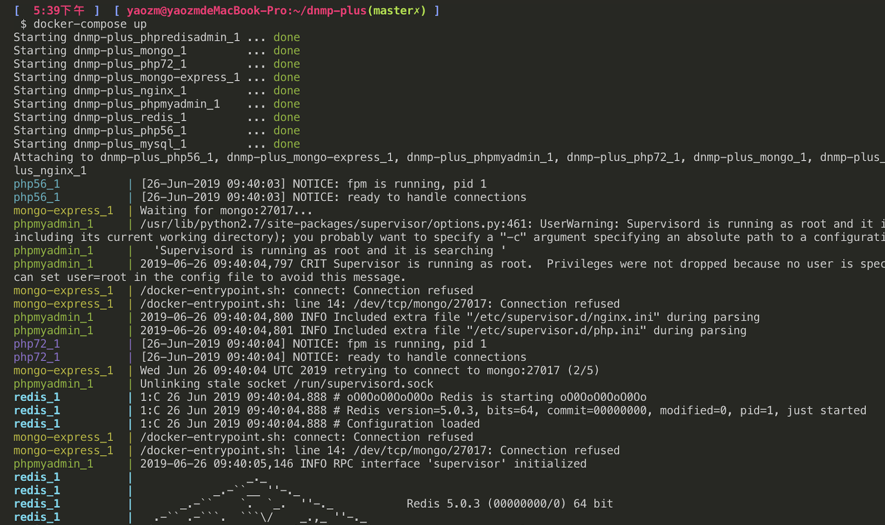
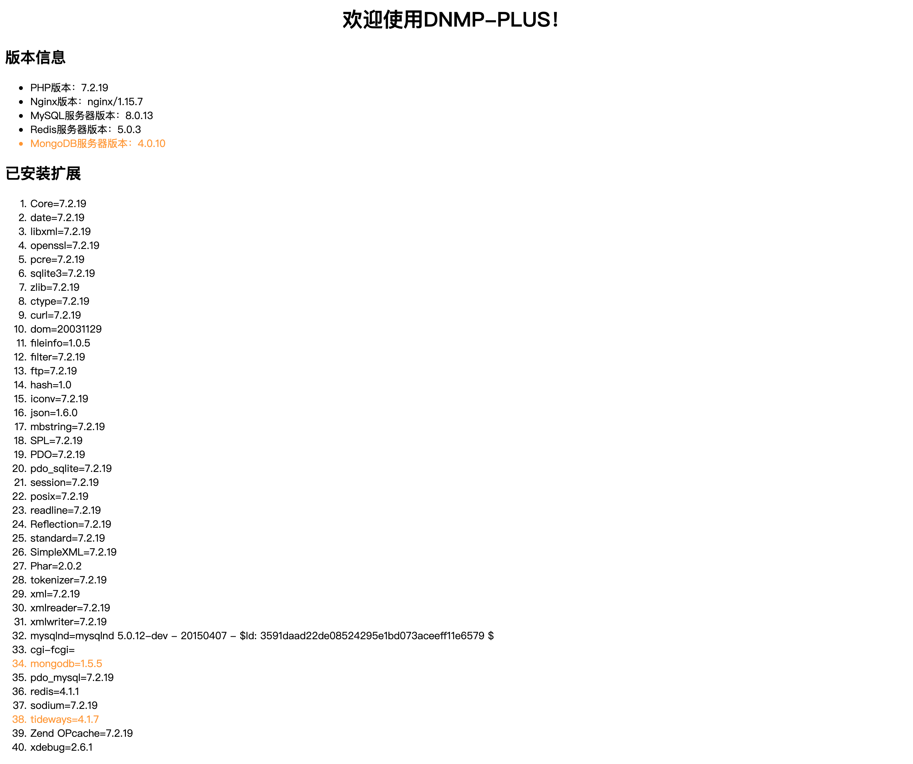
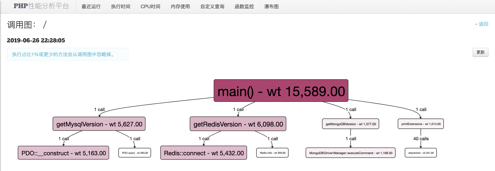

<h1 align="center">DNMP PLUS</h1>

<p align="center">dnmp = Docker+Nginx+MySQL+PHP</p>

<p align="center">plus = xhprof+tideways+xhgui+Redis+MongDB</p>

<p align="center">dnmp-plus = PHPer's one-click installation ultimate debug development environment</p>

---

<p align="center">
    <a>English</a> |
    <a href="README.md">简体中文</a>
</p>

**[dnmp-plus](https://github.com/guanguans/dnmp-plus)** is added on the basis of dnmp:

* [PHP xhprof extension](https://github.com/phacility/xhprof) - PHP performance tracking and analysis tool developed by Facebook
* [PHP tideways extension](https://github.com/tideways/php-xhprof-extension) - branch of xhprof with support for PHP7
* PHP mongodb extension
* MongoDB service
* Mongo Express - MongoDB Service Management System
* [Xhgui](https://github.com/perftools/xhgui) - xhprof GUI system for analyzing data data

[](https://travis-ci.org/guanguans/dnmp-plus)



---

## Directory Structure

``` bash
├── .github                     Github 配置目录
├── conf                        配置文件目录
│   ├── conf.d                  Nginx 用户站点配置目录
│   ├── mysql.cnf               MySQL 用户配置文件
│   ├── nginx.conf              Nginx 默认配置文件
│   ├── php-fpm.conf            PHP-FPM 配置文件
│   ├── php.ini                 PHP 配置文件
│   ├── redis.conf              Redis 配置文件
├── docs                        文档目录
├── extensions                  PHP 扩展源码包
├── log                         日志目录
├── mongo                       MongoDB 数据目录
├── mysql                       MySQL 数据目录
├── www                         PHP 代码目录
├── Dockerfile                  PHP 镜像构建文件
├── docker-compose-sample.yml   Docker 服务配置示例文件
├── env.smaple                  环境配置示例文件
└── travis-build.sh             Travis CI 构建脚本
```

## Environmental requirements

* Docker
* Docker-compose
* Git

## Quick use

``` bash
$ git clone https://github.com/guanguans/dnmp-plus.git --recursive
$ cd dnmp-plus
$ cp env.sample .env
$ cp docker-compose-sample.yml docker-compose.yml
$ docker-compose up -d
```

OK, you now have a dnmp-plus development environment, the default web root directory `www/localhost/`, the browser accesses http://localhost



## Basic use

``` bash
# 服务选项：nginx、php72、php56、mysql、mongo、redis、phpmyadmin、phpredisadmin、mongo-express

# 创建并且启动容器
$ docker-compose up 服务1 服务2 ...
# 创建并且启动所有容器
$ docker-compose up

# 创建并且已后台运行的方式启动容器
$ docker-compose up -d 服务1 服务2 ...

# 启动服务
$ docker-compose start 服务1 服务2 ...

# 停止服务
$ docker-compose stop 服务1 服务2 ...

# 重启服务
$ docker-compose restart 服务1 服务2 ...

# 构建或者重新构建服务
$ docker-compose build 服务1 服务2 ...

# 进入命令行容器
$ docker-compose exec 服务 bash

# 删除并且停止容器
$ docker-compose rm 服务1 服务2 ...

# 停止并删除容器，网络，图像和挂载卷
$ docker-compose down 服务1 服务2 ...
```

## For xhgui use, you can refer to https://github.com/guanguans/guanguans.github.io/issues/9
installation

### Installation

``` bash
$ cd www/xhgui-branch
$ composer install
```

### Modify the xhgui-branch configuration file `www/xhgui-branch/config/config.default.php`

``` php
<?php
return array(
    ...
    'debug'        => true, // changed to true for easy debugging
    'mode'         => 'development',
    ...
    'extension'    => 'tideways', // changed to support tideways for PHP7
    ...
    'save.handler' => 'mongodb',
    'db.host'      => 'mongodb://mongo:27017', // 127.0.0.1 changed to mongo
    ...
);
```

### Added in the hosts file

``` bash
127.0.0.1             xhgui.test
```

### Browser access http://xhgui.test


### Modify in the nginx configuration file to analyze the project, with the default localhost configuration `conf/conf.d/localhost.conf` as an example

``` conf
...
location ~ \.php$ {
    fastcgi_pass   php72:9000;
    fastcgi_index  index.php;
    include        fastcgi_params;
    fastcgi_param  PATH_INFO $fastcgi_path_info;
    fastcgi_param  SCRIPT_FILENAME  $document_root$fastcgi_script_name;
    # 在执行主程序之前运行我们指定的PHP脚本
    fastcgi_param  PHP_VALUE "auto_prepend_file=/var/www/html/xhgui-branch/external/header.php"; 
}
...
``` 

### Restart nginx

``` bash
$ docker-compose restart nginx
```

### The browser visits http://localhost](http://localhost) and then visits [http://xhgui.test](http://xhgui.test). Now that you have the content, you can enjoy the performance tracking and analysis of the project




## PHP and extensions

### Switch the PHP version used by Nginx

By default, both PHP5.6 and PHP7.2 2 PHP versions of the container are created. Switching PHP only needs to modify the `fastcgi_pass` option of the corresponding site Nginx configuration. For example, the example [http://localhost](http://localhost) uses PHP7.2, Nginx configuration:

``` conf
fastcgi_pass   php72:9000;
```

To use PHP 5.6 instead, change it to:

``` conf
fastcgi_pass   php56:9000;
```

Restart Nginx to take effect

``` bash
$ docker-compose restart nginx
```

### Install PHP extensions

Many of PHP's features are implemented through extensions, and installing extensions is a slightly time-consuming process, so in addition to the PHP built-in extensions, we only install a few extensions by default in the `env.sample` file. If you want to install more extensions, please Open your `.env` file and modify the PHP configuration as follows to add the required PHP extensions:

``` bash
PHP72_EXTENSIONS=pdo_mysql,opcache,redis,xdebug,mongodb,tideways
PHP56_EXTENSIONS=opcache,redis,xdebug,mongodb,xhprof
```

Then rebuild the PHP image

``` bash
docker-compose build php72
docker-compose up -d
```

## Use Log

The location where the Log file is generated depends on the value of each log configuration under conf.

### Nginx Log

The Nginx log is the one we use the most, so we put it under the root directory `log`. The `log` directory maps the /var/log/nginx directory of the Nginx container, so in the Nginx configuration file, you need to output the location of the log. We need to configure it to the `/var/log/nginx` directory, such as:

``` conf
error_log  /var/log/nginx/nginx.localhost.error.log  warn;
```

### MySQL log

Because MySQL in the MySQL container uses the `mysql` user to start, it cannot add log files by itself under `/var/log`. So, we put the MySQL log in the same directory as data, the `mysql` directory of the project, corresponding to the `/var/lib/mysql/` directory in the container.

Configuration of the log file in mysql.conf:

``` conf
slow-query-log-file     = /var/lib/mysql/mysql.slow.log
log-error               = /var/lib/mysql/mysql.error.log
```

## Database management

* Default phpMyAdmin address: http://localhost:8080
* Default phpRedisAdmin address: http://localhost:8081
* Default Mongo Express address: http://localhost:8082

## Reference link

* [https://github.com/yeszao/dnmp](https://github.com/yeszao/dnmp)，yeszao

## License

[MIT](LICENSE)
